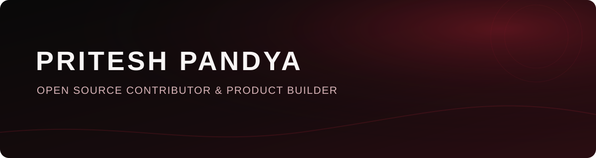

  

# Hi 👋, I'm Pritesh Pandya

I'm an Engineering Student passionate about **Software Development, AI/ML, and Open Source**. I enjoy building practical projects, exploring new technologies, and continuously improving my skills by learning and building in public.

Portfolio 🔗 : https://pritesh-portfolio-sigma.vercel.app/

## What I am exploring

- Core programming concepts and problem-solving with C
- Semantic HTML, accessibility basics, and web-design fundamentals
- Building full-stack web applications and understanding how their pieces fit
  together
- Learning in public through small exercises, experiments, and project work

## Technologies

### Programming languages

### Web development

These technologies reflect the projects and learning repositories currently
visible on my profile, not a fixed list. I expect this section to grow with my
experience.

## GitHub activity

GitHub's contribution graph appears automatically on my profile. The cards
below add a compact view of recent activity and repository languages.

## Featured work

### [GlobeTrotter](https://github.com/prtspndy/GlobeTrotter)

A personalized travel-planning platform created for the **Odoo x LDCE
Ahmedabad Hackathon 26**. It brings together multi-city itineraries,
destination discovery, budget tracking, shareable trips, and an admin
dashboard. The project uses React, Vite, Tailwind CSS, Node.js, Express,
MongoDB, and authentication with JWT and Google OAuth.

### [Web-Designing](https://github.com/prtspndy/Web-Designing)

An open learning journal for web-design fundamentals. It currently contains
HTML exercises covering document structure, headings, paragraphs, forms, and
introductory semantic and accessibility practices.

### [C-language](https://github.com/prtspndy/C-language)

Beginner-friendly C exercises and lab work covering input/output, arithmetic,
and conditional logic. The repository keeps examples small and focused so
each concept can be studied and practiced independently.

### [C-Project](https://github.com/prtspndy/C-Project)

My first C project: a 2025 calendar. It marks an early step in my programming
journey and reflects the project-based approach I use to reinforce new
concepts.

## Learning in public

I am treating this profile as a long-term record of progress rather than a
finished résumé. As I learn, I plan to add more focused exercises, improve
existing projects, and share useful experiments and open-source work.

## Connect

- [LinkedIn](https://www.linkedin.com/in/pritesh-pandya-0702prts)
- [X](https://x.com/prtspndy)
- [Kaggle](https://www.kaggle.com/priteshpandya)
- [YouTube](https://youtube.com/@priteshpandya-20)

Thanks for visiting and exploring my work.

